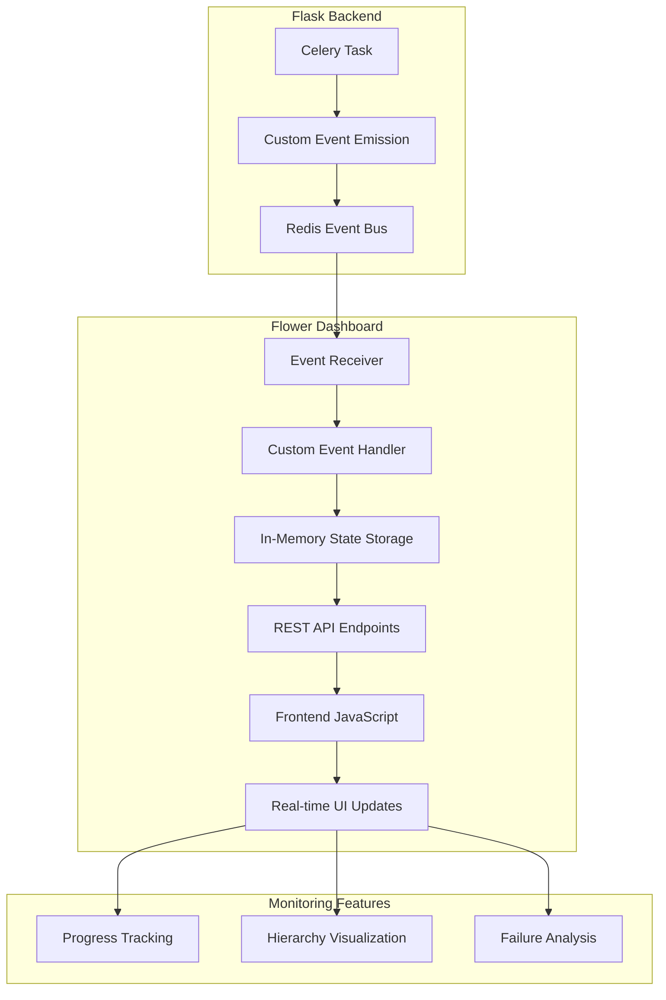
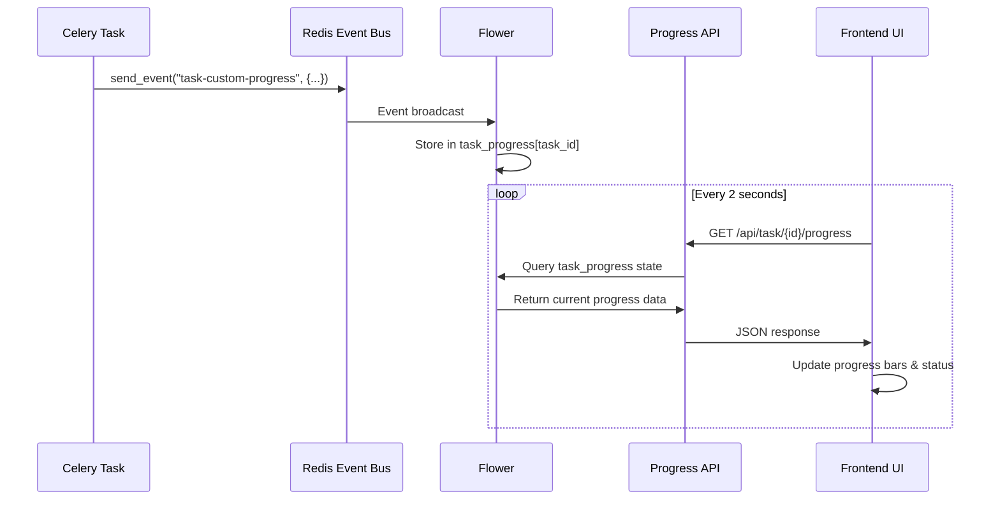
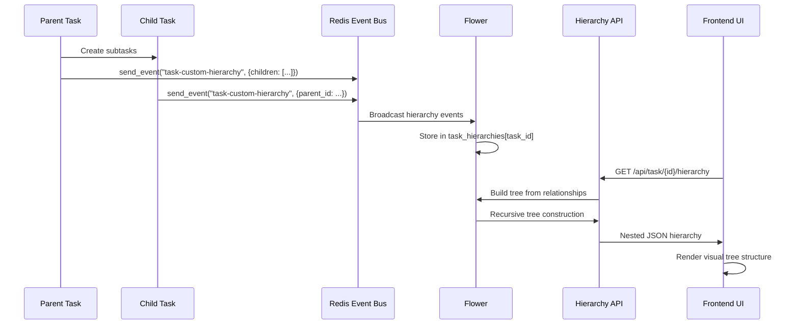
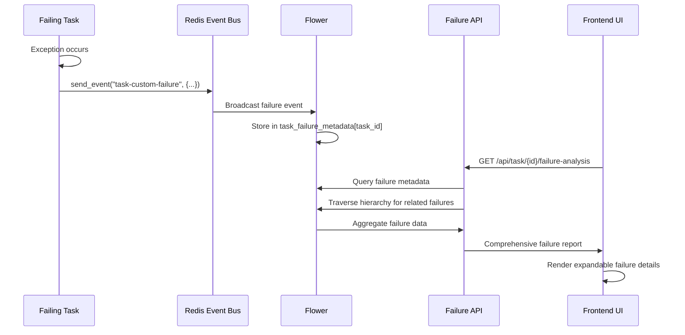
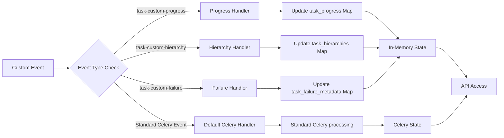
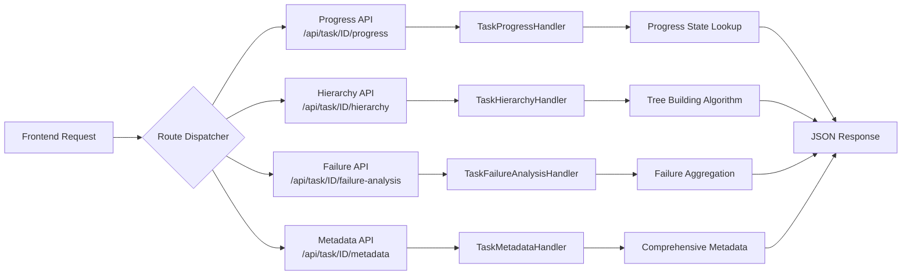
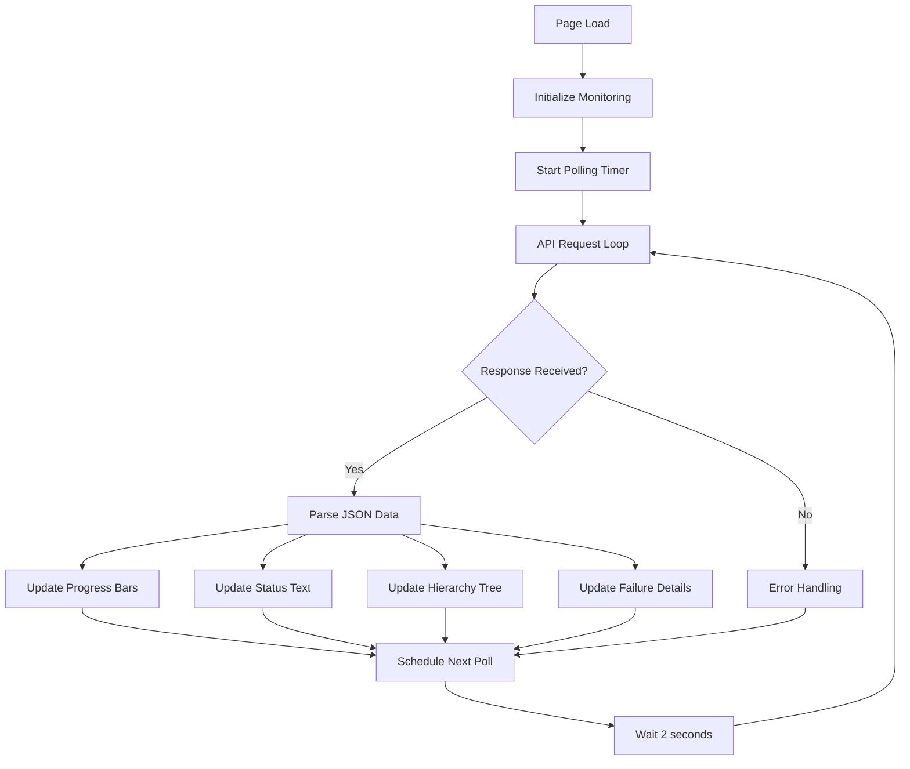
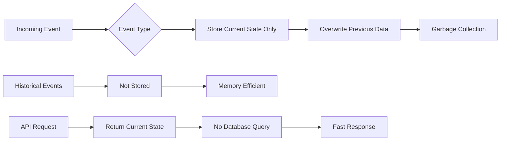

# Task Monitoring System
**A comprehensive real-time monitoring solution for Celery task workflows**

---

## Executive Summary

The Enhanced Task Monitoring System extends Celery's built-in monitoring capabilities to provide real-time progress tracking, hierarchical task visualization, and comprehensive failure analysis through an event-driven architecture that operates without requiring additional databases or infrastructure changes.

---

## System Overview

### Core Architecture

Our monitoring system leverages Celery's existing event infrastructure, enhancing it with custom event types that provide detailed insights into task execution patterns and relationships.

<details>
<summary>System Architecture Diagram</summary>



</details>

### Key Benefits

- **Real-time Monitoring**: Live updates without page refreshes
- **Zero Infrastructure Changes**: Uses existing Redis and Celery setup
- **Comprehensive Insights**: Progress, hierarchy, and failure analysis
- **Memory Efficient**: Current-state-only storage approach
- **Backward Compatible**: Works alongside existing Celery monitoring

---

## Feature Deep Dive

### 1. Progress Tracking

Real-time progress monitoring with detailed status updates and completion metrics.

<details>
<summary>Progress Tracking Flow</summary>



</details>

<details>
<summary>Key Data Structure</summary>

```json
{
  "progress_percent": 75.5,
  "status": "Processing item 755/1000",
  "current": 755,
  "total": 1000,
  "stage": "data_processing",
  "subtasks_created": 10,
  "subtasks_completed": 7,
  "subtasks_failed": 1,
  "subtasks_remaining": 2,
  "last_updated": 1697123456.789
}
```

</details>

**Features:**
- Live progress bars with percentage completion
- Detailed status messaging
- Stage-based processing tracking
- Subtask summary for parent tasks
- Performance metrics and timing data

### 2. Hierarchy Visualization

Interactive tree visualization showing parent-child task relationships and dependencies.

<details>
<summary>Hierarchy Tracking Flow</summary>



</details>

<details>
<summary>Tree Building Algorithm</summary>

```python
def build_hierarchy_tree(self, root_task_id, events_state):
    def build_tree(task_id, visited=None, max_depth=5):
        if task_id in visited or len(visited) > max_depth:
            return None
        
        visited.add(task_id)
        task_info = get_task_info(task_id)
        
        # Get children from hierarchy data
        hierarchy_data = events_state.task_hierarchies.get(task_id, {})
        children_ids = hierarchy_data.get("children", [])
        
        # Build children recursively
        children = []
        for child_id in children_ids:
            child_tree = build_tree(child_id, visited.copy(), max_depth)
            if child_tree:
                children.append(child_tree)
        
        task_info["children"] = children
        return task_info
    
    return build_tree(root_task_id)
```

</details>

**Features:**
- Visual tree structure with depth indicators
- Interactive navigation between related tasks
- Real-time progress across the entire hierarchy
- Task type classification and metadata
- Cycle detection for complex workflows

### 3. Failure Analysis

Comprehensive failure reporting with detailed context and debugging information.

<details>
<summary>Failure Analysis Flow</summary>



</details>

<details>
<summary>Failure Data Structure</summary>

```json
{
  "failure_reason": "Database connection failed during batch processing",
  "failure_stage": "data_persistence",
  "failure_metadata": {
    "error_type": "DatabaseError",
    "affected_records": 1500,
    "retry_attempts": 3,
    "operation_context": {
      "batch_size": 100,
      "current_batch": 15,
      "transaction_id": "tx_789"
    }
  },
  "retry_count": 3,
  "last_error": "Connection to database timed out",
  "error_traceback": "Traceback (most recent call last)...",
  "failed_at": 1697123500.456
}
```

</details>

**Features:**
- Rich failure context beyond standard exceptions
- Business logic metadata preservation
- Hierarchical failure analysis across task trees
- Expandable error details with full tracebacks
- Pattern analysis for recurring failures

---

## Technical Architecture

### Event Processing Pipeline

<details>
<summary>Event Processing Flow</summary>



</details>

### API Endpoint Architecture

<details>
<summary>API Routing Structure</summary>



</details>

### Frontend Update Mechanism

<details>
<summary>Real-time Update Loop</summary>



</details>

---

## Implementation Guide

### Backend Integration

<details>
<summary>Task Enhancement Example</summary>

```python
from monitoring_events import enhanced_monitoring, send_progress_event

@celery_app.task(bind=True)
@enhanced_monitoring(task_type="single")
def process_data(self, data_list):
    total_items = len(data_list)
    
    for i, item in enumerate(data_list):
        # Existing processing logic
        process_item(item)
        
        # Add progress tracking
        progress = ((i + 1) / total_items) * 100
        send_progress_event(
            progress_percent=progress,
            status=f"Processed {i + 1}/{total_items} items",
            current=i + 1,
            total=total_items,
            stage="processing_items"
        )
    
    return "completed"
```

</details>

### Configuration Requirements

<details>
<summary>Celery Configuration</summary>

```python
# Essential Celery settings for enhanced monitoring
celery_app.conf.update(
    worker_send_task_events=True,
    task_send_sent_event=True,
    task_track_started=True,
    task_serializer='json',
    accept_content=['json'],
    result_serializer='json',
)
```

</details>

### Deployment Strategy

1. **Enhanced Flower Deployment**: Deploy this enhanced version on a monitoring server
2. **Redis Connectivity**: Ensure Redis access from both backend and monitoring systems
3. **Task Integration**: Add monitoring decorators to existing Celery tasks
4. **API Configuration**: Configure enhanced API endpoints in Flower routing
5. **Frontend Assets**: Deploy enhanced JavaScript and templates

---

## Performance and Scalability

### Memory Management

<details>
<summary>Memory Optimization Strategy</summary>



</details>

**Key Strategies:**
- Current-state-only storage approach
- Automatic cleanup of completed task data
- In-memory operations for sub-millisecond response times
- Memory usage scales linearly with active task count

### Horizontal Scaling

- Multiple Flower instances can monitor the same Redis stream
- Event processing is stateless and distributable
- Frontend polling distributes load across API endpoints
- Redis event expiration handles long-term storage management

---

## Security and Reliability

### Error Handling

- Custom event handler failures do not affect standard Celery operation
- Malformed events are logged and discarded safely
- API endpoints return graceful defaults for missing data
- Frontend continues polling after temporary network failures

### Data Consistency

- In-memory state updates are atomic operations
- Event ordering preserved through Redis message queuing
- Race conditions prevented through single-threaded event processing
- Backward compatibility with existing Celery monitoring

---

### Extensibility

The event-driven architecture allows for easy addition of new monitoring features without affecting existing functionality. New event types can be added to support domain-specific monitoring requirements while maintaining the same reliable infrastructure.

---

## Conclusion

The Enhanced Task Monitoring System provides a comprehensive solution for real-time Celery task monitoring through a carefully designed event-driven architecture that leverages existing infrastructure while providing powerful new insights into task execution patterns, relationships, and failure modes. The system's memory-efficient design and backward compatibility make it suitable for production deployment across various scales of operation.